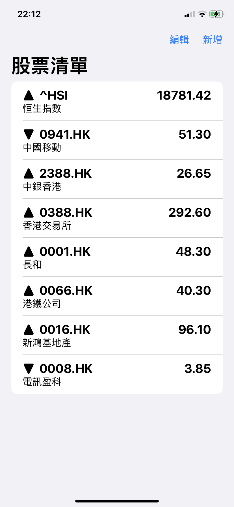

# Lock Screen Stock 鎖屏股票小工具

學習 Swift 和 SwiftUI 的試作，因 iOS 16 本身的股票小工具只有一個，只可以看3隻股票，
用這方法可以在看3+3+1隻股票

## 主要功能

- [x] 使用 Yahoo Finace API 拿取資料
- [x] 一個 Inline 小工具 顯示第一隻股票
- [x] 二個 Rectangular 小工具 顯示第二至七隻股票
- [x] 5分鐘更新一次

